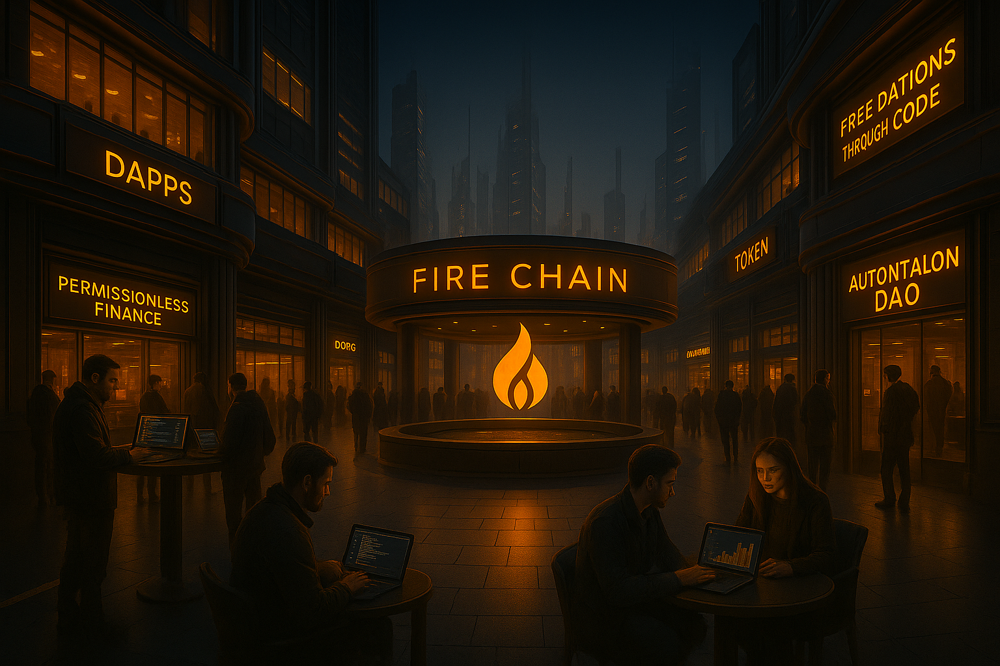

<p align="center">
  
</p>

<h1 align="center">🔥 Fire Wallet CLI</h1>
<p align="center">
  <strong>Geração segura, offline e determinística de carteiras FireChain com endereço <code>f1...</code> garantido.</strong><br />
  <em>Clean code. Zero REST. Zero rede. 100% auditável.</em>
</p>

<p align="center">
  <!-- 🔥 Nome + versão -->
  
  
  
  
  
  
  
  
  
  
</p>

---

🚀 O QUE É — FIRE WALLET CLI
=============================

O Fire Wallet CLI é um utilitário institucional e minimalista da FireChain, projetado para gerar carteiras com identidade exclusiva `f1...`, de forma local, segura e auditável — sem qualquer conexão com rede, servidores ou serviços externos.

> 🔐 Ele entrega um padrão de autocustódia verdadeiro — onde tudo é gerado na sua máquina, sem REST, sem cache, sem exposição.

Construído com foco em:

- Segurança criptográfica real: SECP256k1, SHA256 e RIPEMD160
- Determinismo confiável: endereço "f1..." garantido por design
- Fingerprints visuais para auditoria e verificação manual
- Execução instantânea, sem delays ou dependências

💡 Ideal para quem exige autonomia, segurança e identidade nativa FireChain.

---

🧠 COMO O ENDEREÇO f1... É GERADO?
===================================

> Processo criptográfico inspirado em blockchains sérias como Bitcoin, mas com identidade FireChain nativa e prefixo institucional fixo.

Etapas determinísticas e auditáveis:

1. 📤 Chave pública → SHA256 → RIPEMD160  
2. 🧱 Aplicação do prefixo institucional fixo `[0x15, 0x67]` (derivado para gerar "f1" via Base58Check)  
3. ✅ Cálculo do checksum: SHA256(SHA256(payload)) → primeiros 4 bytes  
4. 🔁 Codificação final em Base58Check  

🔗 Resultado: Endereço FireChain com prefixo garantido `f1...` (ex: `f1kWx6pQ9HkEM...`)

---

💡 Por que isso é revolucionário?

Ao contrário de sistemas tradicionais (como Ethereum ou Bitcoin) onde o prefixo do endereço é herdado automaticamente do tipo de rede, **a FireChain introduz uma padronização visual e técnica no endereço institucional `f1...`**, garantindo:

- ✅ Identidade visual única e exclusiva para o ecossistema FireChain  
- ✅ Validação rápida, simples e humana de endereços válidos  
- 🔐 Determinismo confiável sem customização ou tentativa/erro  
- 🚫 Nenhum uso de REST, backends ou servidores

Esse modelo segue os princípios da descentralização real e identidade de rede — reforçando a FireChain como infraestrutura institucional de autocustódia digital.

---

## 🔐 Segurança institucional

| Elemento              | Padrão FireChain                |
|-----------------------|----------------------------------|
| 🔒 Geração da chave   | Local via `OsRng` + SECP256k1    |
| 🔑 Endereço `f1...`   | Prefixo binário `[0x15, 0x67]`   |
| 🔁 Determinístico     | Sim, com derivação baseada em hash |
| 🧠 Fingerprint visual | SHA256 da chave pública (8 bytes) |
| ☁️ Conexão externa    | ❌ Nenhuma. 100% offline          |

---

## 📦 Comparativo com outras wallets

| Feature                     | Fire Wallet CLI | MetaMask | Trust Wallet |
|-----------------------------|-----------------|----------|--------------|
| 📡 Funciona offline         | ✅               | ❌       | ❌           |
| 🔗 Endereço institucional   | `f1...` exclusivo| `0x...`  | `0x...`      |
| 🧠 Fingerprint visual       | ✅ SHA256 (8B)   | ❌       | ❌           |
| 🔁 Determinismo             | ✅               | ❌       | ❌           |
| 🔐 Autocustódia real        | ✅               | Parcial  | Parcial      |

---

## 🔧 Instalação

```bash
# Clone o repositório
git clone https://github.com/guilhermelimaweb3/firewallet.git
cd firewallet

# Build otimizado (recomendado)
cargo build --release
```

> Requer: Rust 1.70+ instalado

---

🧪 COMO USAR — FIRE WALLET CLI
==============================

1. 🔧 Gerar uma nova carteira FireChain

Comando:
```bash
fire-wallet-cli new
```

Saída esperada:
```
🔥 Fire Wallet CLI
🔐 Carteira FireChain local e segura — Geração instantânea com endereço f1...

🆔 Fingerprint: 8A62D8A9CC23B0F1   # Hash visual da chave pública
🧠 Chave Pública: 04A1...          # Chave SECP256k1 (formato uncompressed)
🔒 Chave Privada: 22C4...          # Exportável apenas localmente
🔥 Endereço FireChain: f1kWx6p...  # Endereço institucional prefixado "f1"
```

---

2. 🌍 Tornar o CLI acessível globalmente (Windows)

Após o build, copie o binário para uma pasta global:

```powershell
copy .\target\release\fire-wallet-cli.exe C:\Tools\
$env:PATH += ";C:\Tools\"
```

Agora você pode rodar de qualquer lugar:

```bash
fire-wallet-cli new
```

---

3. 📂 Local padrão do binário gerado

- Windows: .\target\release\fire-wallet-cli.exe  
- Linux/macOS: ./target/release/fire-wallet-cli

---

4. 💡 Dica institucional (futuro)

Em breve será possível gerar saídas estruturadas com:

```bash
fire-wallet-cli export --json
```

---

## 🧠 Estrutura de pastas

```txt
firewallet/
├── assets/                    # 🖼️ Imagens institucionais (ex: banner CLI)
│   └── banner.png
│
├── src/                       # 🧠 Código-fonte principal
│   ├── bin/                   # 🧭 Entrypoint CLI
│   │   └── main.rs
│   ├── cli/                   # 🎛️ Interface CLI: parsing e handlers
│   │   ├── handler.rs
│   │   └── parser.rs
│   ├── core/                  # 🔐 Núcleo: geração de chaves e endereço f1
│   │   ├── address.rs         # ↪️ Derivação institucional do endereço FireChain
│   │   └── wallet.rs          # 🔑 Geração e fingerprint das chaves
│   ├── error.rs               # ⚠️ Enum centralizado de erros do CLI
│   └── lib.rs                 # 📦 Entry point para módulos da lib
│
├── tools/                     # 🧪 Utilitários internos FireChain
│   └── find_prefix.rs         # 🔍 Scanner institucional para prefixos binários
│
├── target/                    # ⚙️ Diretório de build (ignorado pelo Git)
├── .gitignore                 # 🚫 Regras de exclusão do Git (ex: wallets, builds)
├── Cargo.toml                 # 🛠️ Manifesto do projeto Rust (metadados e deps)
├── Cargo.lock                 # 🔒 Lockfile do Cargo (versões exatas)
├── LICENSE.md                 # 📜 Licença FireChain Dual
└── README.md                  # 📘 Documentação institucional e instruções
```

---

## 📄 Licença FireChain Dual 🔐

Distribuído sob a **Licença FireChain Dual**:

- ✅ Uso pessoal, educativo e autocustódia
- 💼 Uso comercial e institucional apenas mediante autorização

[Leia os termos completos →](./LICENSE.md)

---

👤 Desenvolvido por [Guilherme Lima](https://www.linkedin.com/in/guilhermelimadev-web3/)  
📦 Repositório oficial: [github.com/guilhermelimaweb3/firewallet](https://github.com/guilhermelimaweb3/firewallet.git)
